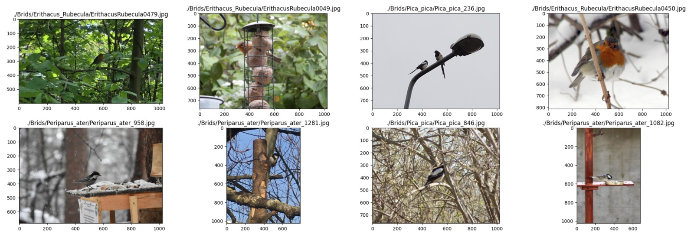

# Bird Species Detection and Classification

This repository contains code for preprocessing, training, evaluation, and inferencing of two models, SSD and Faster R-CNN, for the task of bird detection and classification. The main objective of this project is to detect the presence of birds in an input image, classify them into three species (European robin, Coal Tit, and Eurasian magpie), and localize the birds within the image. The models were trained using transfer learning from the TensorFlow model zoo and further refined using a dataset of 3000 bird pictures. The performance of both models was compared. Faster R-CNN outperformed SSD with an overall accuracy of 92% and higher mean average precision scores at both IOU thresholds (0.882 at IOU 0.50 and 0.765 at IOU 0.75).

To facilitate interaction with the trained Faster R-CNN model, a Flask web application has been developed using the TFServing and MySQL. For more information about the Flask web application and its implementation, please follow [This Link](https://github.com/mariamkhmahran/bird-classifier-ui).

## Data Description

The dataset used in this project consists of 3000 bird images, evenly divided into three classes corresponding to the three bird species. The images vary in size, but the majority have heights and widths of at least 600 pixels. The dataset includes images taken in daylight with birds in various positions and distances from the camera lens. Table I shows the number of images and tags (bounding boxes) per class after the data cleaning process.

| Species | European robin | Coal Tit | Eurasian magpie |
| ------- | -------------- | -------- | --------------- |
| Images  | 869            | 871      | 851             |
| Tags    | 872            | 889      | 937             |

Each image in the dataset may contain one or multiple birds, leading to an uneven distribution of tags among the different classes.

The figure below shows some examples of the images included in the dataset.

## Methodology

The methodology used in this project can be summarized as follows:

### Data Cleaning

Unusable images were filtered out from the dataset through the following steps:

1. Removal of duplicate images.
2. Exclusion of images without visible birds.
3. Deletion of low-resolution images.

After data cleaning, the remaining images accounted for approximately 88% of the original dataset.

### Data Tagging

The dataset was carefully tagged with bounding boxes drawn around the birds in each image. The tags were exported in TensorFlow Pascal VOC format as XML files, containing the necessary information for image filenames, bounding boxes, and class labels.

### Data Augmentation

To address class imbalance and enhance dataset variability, data augmentation techniques were applied. Augmentation included adding random brightness and contrast jitters to images and flipping some images horizontally. Each class was limited to a maximum of 1000 tags to achieve a balanced representation.

### Transfer Learning

Both models, Faster R-CNN and SSD, were pre-trained on the COCO 17 dataset using the ResNet101 architecture as the backbone. Transfer learning allowed the models to leverage knowledge obtained from a larger dataset and fine-tune their performance using the bird image dataset.

### Model Architecture

For a baseline comparison, two powerful models were employed to perform the task at hand: the TensorFlow Faster R-CNN ResNet101 V1 1024x1024 and the TensorFlow SSD ResNet101 V1 FPN 1024x1024. Faster R-CNN is region-proposal-based, while SSD is a regression/classification-based framework. Both models utilize the ResNet101 architecture as the backbone.

### Model Training and Evaluation

To facilitate the training and evaluation of the bird detection model, the TensorFlow Object Detection API is utilised. Using the API, training and evaluation sets are serialised into two separate TFRecords. TFRecords serve as a vital tool for storing serialised data in a format that TensorFlow can readily read and process during training or inference tasks.

To ensure consistent and reproducible results for both models, a configuration file called "pipeline.config" was created for each model. The aspect ratio resizer in the pipeline.config is set to 1024x1024. Additionally, for optimisation, the momentum optimiser is used during training for both models. The optimiser is defined in the config file with the cosine_decay_learning_rate as the learning rate and a learning rate base of 0.0004.

The NVIDIA GeForce RTX 3090, a powerful graphics processing unit, is utilised to accelerate the training process and handle the computational demands effectively. With its high-performance capabilities, the GeForce RTX 3090 contributes to faster training iterations, allowing for quicker convergence and improved model accuracy.

Each model is trained on the 90% training split over 50k epochs. Simultaneously, the remaining 10% split is utilised for model evaluation. The models are evaluated throughout training to assess the overall loss change.

### Inferencing

To evaluate the effectiveness of the trained models and determine the more suitable one for the task at hand, both models are subjected to inferencing using fresh, unseen images that were not part of the original dataset. Specifically, 200 bird images were gathered from Google Images for this purpose. These images represent the three targeted bird species, as well as some blank images. The objective is to compare the resulting predictions of both models with the ground truths provided for each image. The performance of each model was evaluated using mean average precision (mAP) at two IOU thresholds: 0.50 and 0.75.

## Results

The following table summerizes the inferencing results for both models

|                  | Faster R-CNN | SSD   |
| ---------------- | ------------ | ----- |
| mAP@0.50IOU      | 0.882        | 0.528 |
| mAP@0.75IOU      | 0.765        | 0.464 |
| accuracy         | 92%          | 54%   |
| avg recall       | 92%          | 54%   |
| avg f1-score     | 93%          | 67%   |
| mean sensitivity | 93%          | 54%   |
| mean specifity   | 98%          | 100%  |

The Faster R-CNN model achieved a higher mean average precision (mAP) at both IOU thresholds compared to the SSD model. This indicates that the Faster R-CNN model performed better in terms of accurately detecting and localizing birds in the images.

The results clearly indicate that the Faster R-CNN model outperforms the SSD model in accurately identifying and localising bird species in images. Faster R-CNN is more effective in this task because of its deeper design, which allows for a bigger model capacity. This increased capacity enables the model to learn intricate features and capture fine-grained details, which is crucial for distinguishing between different species that may exhibit subtle differences. Given that many bird species share similar body forms and skeletal compositions, the ability to detect and analyse tiny features becomes essential. Therefore, the findings strongly support the preference for the Faster R-CNN model as the more reliable and effective choice for the specific task of bird species identification and localisation.

It's important to note that these results were obtained using the specific dataset and training parameters mentioned earlier. The performance of the models may vary depending on the specific use case and dataset characteristics. Further fine-tuning and experimentation could potentially improve the results.

## Deployment

Once the Faster R-CNN model was trained and evaluated, it was frozen and exported in the Google .pb file format. This exported graph can now be used for deployment using TFServing or other compatible platforms.

To facilitate the deployment process, a web application was developed using Flask, TFServing, Docker, and MySQL. The Flask framework provided the foundation for building the web application, while TFServing enabled the serving of the trained model. Docker was utilized for containerization, ensuring consistency and portability across different environments. MySQL was employed as the database system to handle data storage and retrieval.

For further information and access to the codebase, you can visit the [repository available here](https://github.com/mariamkhmahran/bird-classifier-ui). The repository contains detailed instructions, code snippets, and additional resources related to the deployment of the Faster R-CNN model using Flask, TFServing, Docker, and MySQL.

## Potential Applications

This study aims to contribute to the growing field of conservation technology, showcasing the potential of deep learning and computer vision techniques in automating wildlife conservation activities. By accurately identifying and localising bird species, conservationists can gain valuable insights into animal behaviour and ecological systems, enabling more effective conservation strategies.

The trained Faster R-CNN model can be used for various applications, including bird population monitoring, migration tracking, and studying bird behaviors in their natural habitats.

## Repository Contents

The repository contains the following files and folders:

- `augmentation`: This folder contains the images that were manually selected to apply augmentation techniques to during the preprocessing stage.
- `data`: Inside this folder, you can find the TFRecords, which store the dataset in a format suitable for TensorFlow, and the label map, which defines the mapping between class labels and their corresponding numeric IDs.
- `images`: This folder serves as a placeholder for the dataset images (the actual dataset is not included in this repository). After running the `partition_dataset.py` script, the images and their corresponding tags should be randomly split into the `/train` and `/test` subfolders.
- `tags`: This folder acts as a placeholder for the tags XML files associated with the images in the dataset.
- `test_images`: Here, you can find the images used for inferencing and evaluating the trained models.
- `tools`: This directory contains various helper scripts to assist with different tasks.
- `training`: The `training` folder contains pretrained models downloaded from the TensorFlow Model Zoo. Additionally, it includes the data for both trained models, such as the pipeline configuration, checkpoints, and exported models.
- `Preprocessing.ipynb`: This Jupyter notebook provides code and instructions for preprocessing the images, including augmentation techniques, in order to prepare them for training.
- `Training.ipynb`: This Jupyter notebook guides the process of training the model using the TensorFlow Object Detection API. It includes the necessary code and steps for model training.
- `TensorBoard.ipynb`: This Jupyter notebook demonstrates how to use TensorBoard, a visualization tool, to monitor and analyze the training process, providing useful insights and performance measurements.
- `Evaluation.ipynb`: In this Jupyter notebook, the trained models are evaluated on a test set using the `python model_main_tf2.py` script. This notebook provides code and instructions for performing the evaluation.
- `Inferencing.ipynb`: This Jupyter notebook focuses on inferencing the trained models on new, unseen images and measuring their performance. It includes code and steps for running inference.

